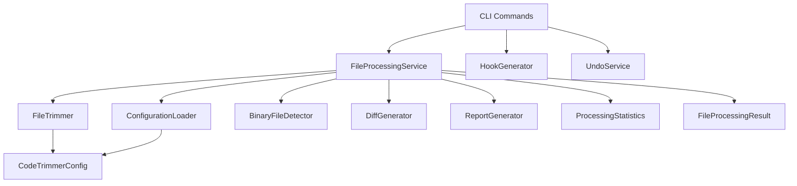
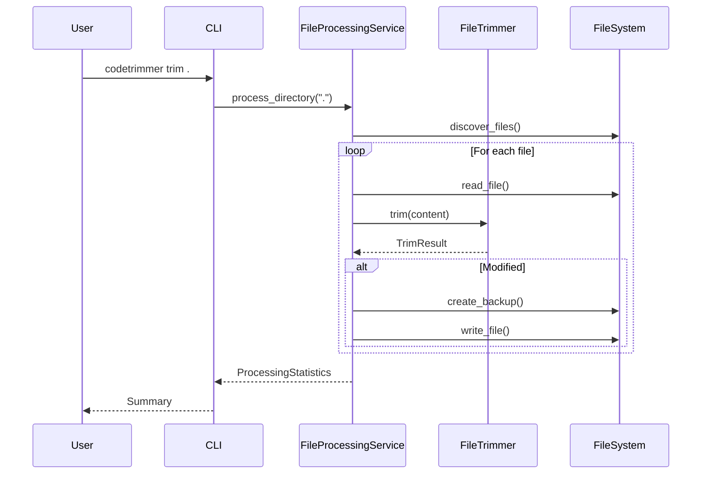
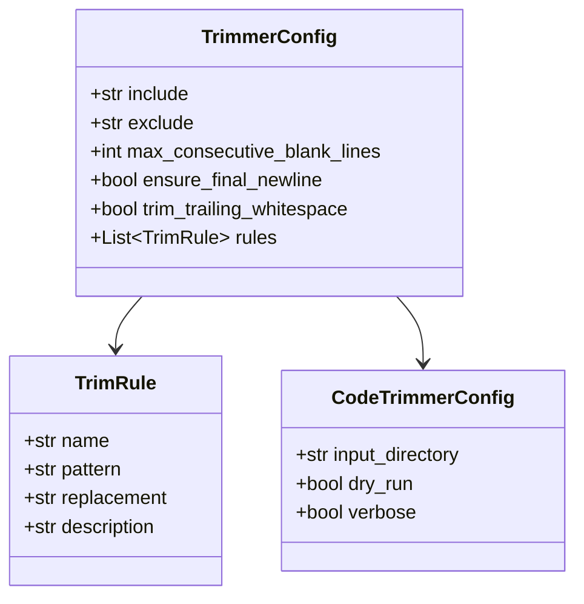

# Architecture Guide

Technical architecture and design of Code Trimmer Python.

## Overview

Code Trimmer is a file formatting and whitespace normalization utility designed following Python best practices and clean architecture principles.

## Directory Structure

```
codetrimmer/
├── __init__.py          # Package initialization
├── __main__.py          # Entry point
├── app.py               # Application bootstrap
├── config/              # Configuration handling
│   ├── loader.py        # ConfigurationLoader
│   ├── models.py        # Config dataclasses
│   └── defaults.py      # Default values
├── cli/                 # Command-line interface
│   ├── commands.py      # CLI commands
│   ├── options.py       # TrimOptions
│   └── output.py        # ColorOutput
├── error/               # Error handling
│   ├── codes.py         # ErrorCode enum
│   └── exceptions.py    # CodeTrimmerException
├── model/               # Data models
│   ├── binary_detector.py
│   ├── file_result.py
│   └── statistics.py
├── service/             # Business logic
│   ├── file_processor.py
│   ├── trimmer.py
│   ├── diff_generator.py
│   ├── hook_generator.py
│   ├── undo_service.py
│   └── report_generator.py
└── util/                # Utilities
    ├── constants.py
    └── color.py
```

## Component Diagram



## Core Components

### ConfigurationLoader

Responsible for loading and validating configuration from multiple sources:

- YAML files (`.codetrimmer.yaml`)
- JSON files (`.codetrimmer.json`)
- Environment variables (`CODETRIMMER_*`)
- CLI options

**Priority:** CLI > Environment > File > Defaults

### FileProcessingService

Main orchestrator for file processing:

1. Loads configuration
2. Discovers files matching patterns
3. Filters binary files
4. Processes each file through FileTrimmer
5. Creates backups if enabled
6. Generates diffs if requested
7. Collects statistics
8. Exports reports

### FileTrimmer

Core trimming logic:

- Trims trailing whitespace
- Reduces consecutive blank lines
- Ensures final newline
- Applies custom regex rules

### BinaryFileDetector

Detects binary files to skip:

- Extension-based detection (fast)
- Content-based detection (null byte check)

### DiffGenerator

Generates unified diff output:

- Line-by-line comparison
- Context lines
- Hunk generation

### HookGenerator

Creates Git pre-commit hooks:

- Bash scripts (Unix)
- Batch files (Windows)
- PowerShell scripts (Windows)

### UndoService

Manages backup restoration:

- Finds `.bak` files
- Restores originals
- Cleans up backups

### ReportGenerator

Exports processing reports:

- JSON format
- CSV format
- SQLite database
- HTTP endpoint

## Data Flow



## Error Handling

All errors are wrapped in `CodeTrimmerException`:

```python
class CodeTrimmerException(Exception):
    def __init__(self, error_code, cause=None, suggestion=None):
        self.error_code = error_code
        self.cause = cause
        self.suggestion = suggestion
```

Error codes follow the pattern `CT-XXXX` for easy identification.

## Configuration Model



## Testing Strategy

- **Unit tests:** Each component tested in isolation
- **Integration tests:** CLI command testing
- **Fixtures:** Temp directories, sample files
- **Coverage target:** >85%

## Performance Considerations

- File streaming for large files
- Early binary detection by extension
- Configurable limits (max files, max size)
- Efficient regex compilation (cached)
