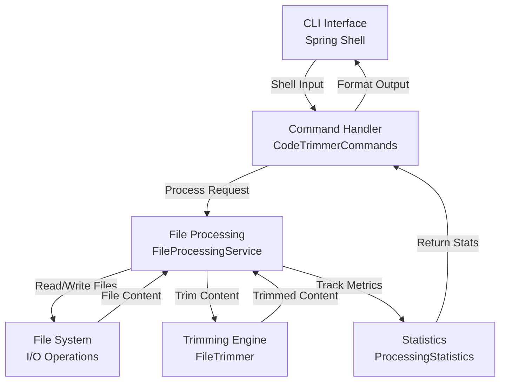
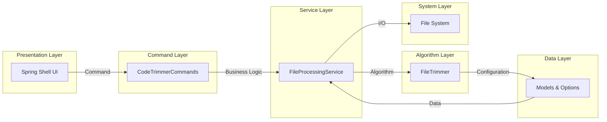
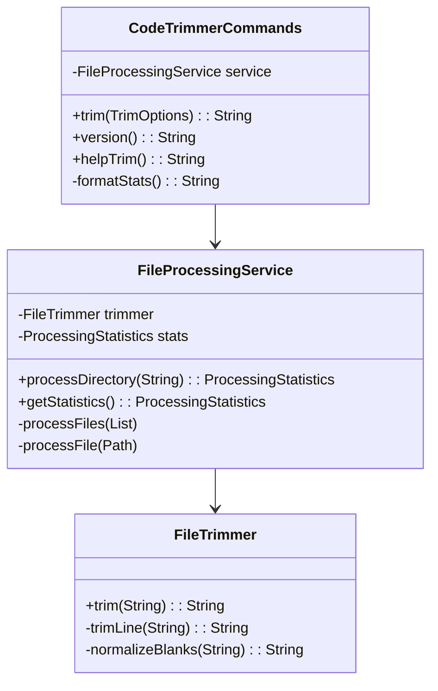
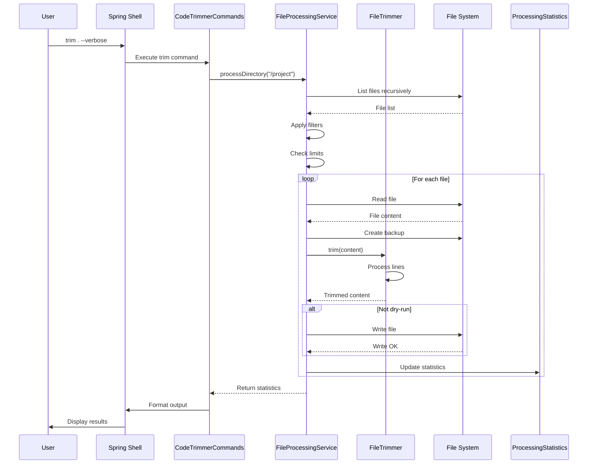
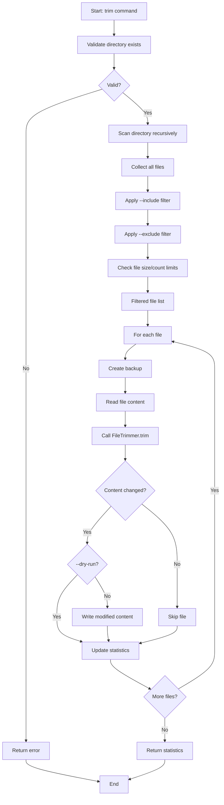
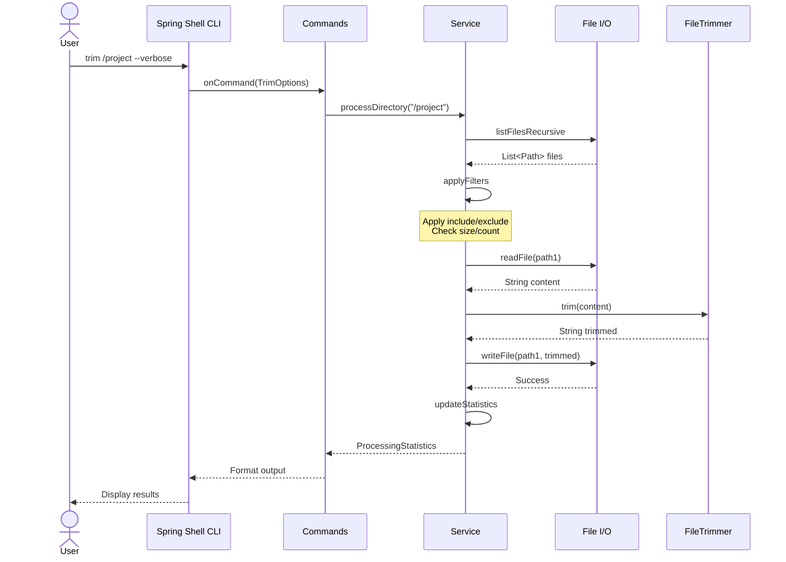
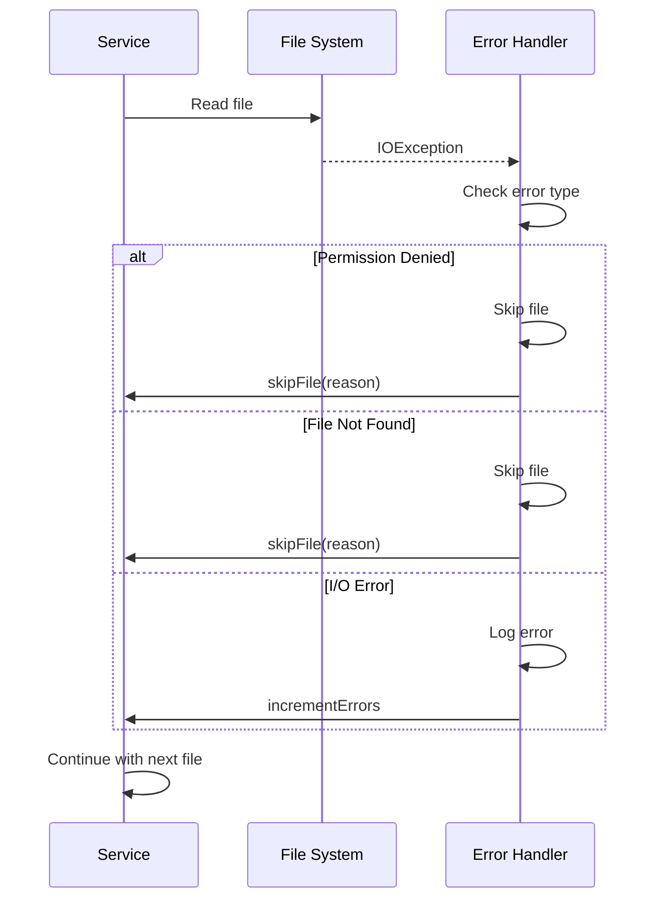

# Architecture Documentation

Complete architectural overview of Code Trimmer, including system design, component relationships, and data flow diagrams.

## Table of Contents

1. [System Architecture](#system-architecture)
2. [Component Descriptions](#component-descriptions)
3. [Data Models](#data-models)
4. [Processing Flow](#processing-flow)
5. [Class Hierarchy](#class-hierarchy)
6. [Sequence Diagrams](#sequence-diagrams)
7. [Design Patterns](#design-patterns)

## System Architecture

### High-Level Architecture



### Component Layers



## Component Descriptions

### 1. Spring Shell (CLI Interface)

**Purpose**: Provide interactive command-line interface

**Responsibilities**:

- Parse user input
- Provide command completion
- Display prompts and help
- Format output

**Key Classes**:

- `SpringBootApplication` - Application entry point
- `ShellHelper` - Utility functions for shell operations

### 2. CodeTrimmerCommands (Command Handler)

**Purpose**: Handle user commands from Spring Shell

**Responsibilities**:

- Process `trim` command
- Expose `version` command
- Provide `help-trim` command
- Route requests to service layer

**Key Methods**:

```java
@ShellMethod
public String trim(TrimOptions options) { ... }

@ShellMethod
public String version() { ... }

@ShellMethod
public String helpTrim() { ... }
```

**Mermaid Class Structure**:



### 3. FileProcessingService (Core Service)

**Purpose**: Orchestrate file processing operations

**Responsibilities**:

- Collect files from directory recursively
- Apply filters (include/exclude)
- Coordinate file processing
- Maintain statistics
- Handle backup creation

**Key Methods**:

```java
public ProcessingStatistics processDirectory(String path)
public ProcessingStatistics getStatistics()
private ProcessingStatistics processFiles(List<Path> files)
private FileProcessingResult processFile(Path filePath)
```

**Processing Logic**:

```shell
processDirectory(path)
├── Validate directory
├── Collect files recursively
│   ├── Apply include filter
│   ├── Apply exclude filter
│   └── Check file size/type
├── processFiles(collected)
│   ├── For each file:
│   │   ├── Create backup
│   │   ├── Read content
│   │   ├── processFile(path)
│   │   ├── Write if not dry-run
│   │   └── Update statistics
│   └── Return aggregated statistics
└── Return ProcessingStatistics
```

### 4. FileTrimmer (Trimming Algorithm)

**Purpose**: Implement whitespace trimming and normalization

**Responsibilities**:

- Remove trailing whitespace
- Normalize blank lines
- Ensure file ending newline
- Preserve leading indentation

**Algorithm**:

```shell
trim(content)
├── Split into lines
├── For each line:
│   ├── trimLine(line)
│   │   ├── Remove trailing whitespace
│   │   └── Return trimmed line
│   └── Collect trimmed line
├── normalizeBlanks(lines)
│   ├── Consolidate blank lines
│   ├── Ensure max consecutive blanks = 2
│   └── Ensure single trailing newline
└── Join and return
```

### 5. TrimOptions (Configuration)

**Purpose**: Hold and validate user options

**Pattern**: Builder pattern for flexible construction

**Fields**:

```java
private String directory;
private String includeExtensions;
private String excludePatterns;
private Long maxFileSize;
private Integer maxFiles;
private Boolean dryRun;
private Boolean verbose;
private Boolean quiet;
private Boolean noColor;
private Boolean includeHidden;
private Boolean backup;
private Boolean noLimits;
```

### 6. ProcessingStatistics (Metrics)

**Purpose**: Track processing metrics and results

**Fields**:

```java
private Long totalFiles;
private Long totalModified;
private Long totalSkipped;
private Long totalErrors;
private Long bytesRemoved;
private Long linesModified;
private Long executionTimeMs;
```

## Data Models

### FileProcessingResult

Represents the result of processing a single file:

```java
public class FileProcessingResult {
    private Path filePath;
    private Boolean modified;
    private String reason;  // if skipped
    private Long bytesChanged;
    private Integer linesChanged;
    private LocalDateTime processedAt;
}
```

### ProcessingStatistics

Aggregates statistics from all processed files:

```java
public class ProcessingStatistics {
    private Long totalFiles;
    private Long totalProcessed;
    private Long totalModified;
    private Long totalSkipped;
    private Long totalErrors;
    private Long totalBytesRemoved;
    private Long totalLinesModified;
    private Long executionTimeMs;
    private List<FileProcessingResult> results;
}
```

### TrimOptions

Configuration container:

```java
@Data
@Builder
public class TrimOptions {
    private String directory;
    private String includeExtensions;
    private String excludePatterns;
    private Long maxFileSize;
    private Integer maxFiles;
    private Boolean dryRun;
    private Boolean verbose;
    private Boolean quiet;
    private Boolean noColor;
    private Boolean includeHidden;
    private Boolean backup;
    private Boolean noLimits;
}
```

## Processing Flow

### Complete Workflow Sequence



### Directory Processing Flow



## Class Hierarchy

### Service Architecture

```shell
┌─────────────────────────────────┐
│   Application (Spring Boot)     │
│                                 │
├─ CodeTrimmerCommands            │
│  ├─ trim(TrimOptions)           │
│  ├─ version()                   │
│  └─ helpTrim()                  │
│                                 │
├─ FileProcessingService          │
│  ├─ processDirectory()          │
│  ├─ processFiles()              │
│  ├─ processFile()               │
│  └─ getStatistics()             │
│                                 │
├─ FileTrimmer                    │
│  ├─ trim()                      │
│  ├─ trimLine()                  │
│  └─ normalizeBlanks()           │
│                                 │
├─ Data Models                    │
│  ├─ ProcessingStatistics        │
│  ├─ FileProcessingResult        │
│  └─ TrimOptions                 │
│                                 │
├─ Configuration                  │
│  ├─ application.yml             │
│  ├─ Environment vars            │
│  └─ Spring properties           │
└─────────────────────────────────┘
```

## Sequence Diagrams

### Successful Trim Operation



### Error Handling Flow



## Design Patterns

### 1. Builder Pattern (TrimOptions)

```java
TrimOptions options = TrimOptions.builder()
    .directory("/project")
    .includeExtensions("java,py")
    .excludePatterns("*.min.js")
    .maxFileSize(5242880)
    .maxFiles(100)
    .dryRun(true)
    .verbose(true)
    .build();
```

### 2. Strategy Pattern (FileTrimmer)

Different trimming strategies could be implemented:

```java
public interface TrimmingStrategy {
    String trim(String content);
}

public class StandardTrimmer implements TrimmingStrategy { ... }
public class AggressiveTrimmer implements TrimmingStrategy { ... }
```

### 3. Visitor Pattern (File Processing)

Process files with specific logic:

```java
public interface FileVisitor {
    void visit(Path file);
}

public class TrimmerVisitor implements FileVisitor { ... }
```

### 4. Statistics/Metrics Pattern

Track and aggregate metrics:

```java
ProcessingStatistics stats = new ProcessingStatistics();
stats.addResult(result);
stats.getStatistics();
```

## Integration Points

### Spring Boot Integration

```shell
@SpringBootApplication
├── @Component: FileProcessingService
├── @Component: FileTrimmer
├── @Component: CodeTrimmerCommands
├── @Configuration: Application configuration
└── application.yml: Property source
```

### Spring Shell Integration

```shell
@ShellComponent: CodeTrimmerCommands
├── @ShellMethod: trim
├── @ShellMethod: version
└── @ShellMethod: helpTrim
```

## Performance Considerations

### Optimization Strategies

1. **File System Access**: Minimize I/O operations
2. **Memory Management**: Process files sequentially
3. **String Operations**: Use StringBuilder for content manipulation
4. **Regex**: Compile patterns once, reuse
5. **Parallelization**: Potential for parallel file processing (future)

### Resource Usage

| Component  | Memory                 | CPU      |
| ---------- | ---------------------- | -------- |
| Shell      | Minimal                | Low      |
| Service    | Moderate               | Moderate |
| Trimmer    | Minimal                | Moderate |
| File I/O   | Dependent on file size | High     |
| Statistics | Minimal                | Low      |

---

**Version**: 1.0.0 | **Last Updated**: December 2025 | **Status**: Production Ready
